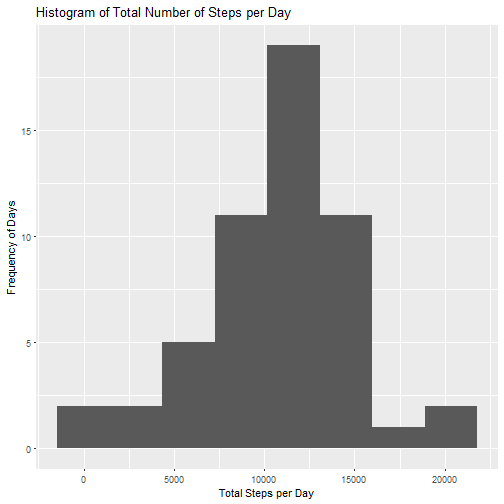
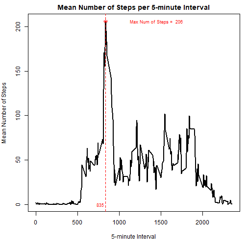
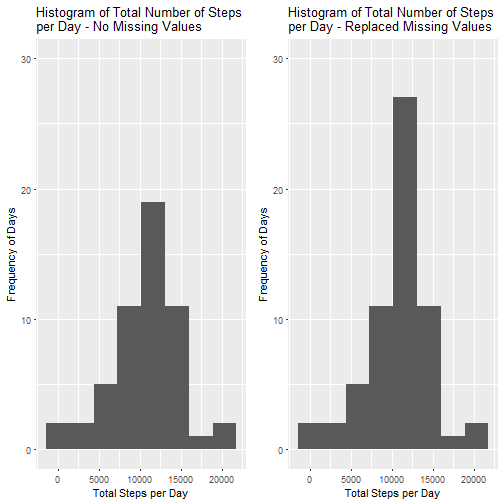
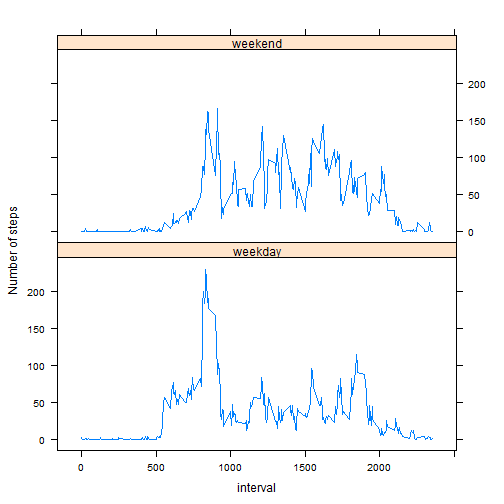

<<<<<<< HEAD
---------------
Author: Brian Rooney
Course: Reproducible Research - Week 2 - Project 1
---------------

# Introduction

This analysis will examine data from a personal activity monitoring device. This device collects the number of steps taken in 5 minute intervals each day, over the months of October and November, 2012 from an anonymous individual.

## Load and Preprocess the Data

```r
  temp <- tempfile()
  download.file("https://d396qusza40orc.cloudfront.net/repdata%2Fdata%2Factivity.zip", temp)
  ## Store activity data in "act" dataframe
  act <- read.csv(unz(temp,"activity.csv"))
  unlink(temp)
  
  act$date <- as.Date(as.character(act$date), "%Y-%m-%d")
```

## Total Number of Steps Taken Each Day

```r
## use aggregate function which ignores missing values by default
totalStepsPerDay <- aggregate(steps ~ date,data=act,FUN = sum)
colnames(totalStepsPerDay) <- c("Date","totalSteps")
totalStepsPerDay
```

```
##          Date totalSteps
## 1  2012-10-02        126
## 2  2012-10-03      11352
## 3  2012-10-04      12116
## 4  2012-10-05      13294
## 5  2012-10-06      15420
## 6  2012-10-07      11015
## 7  2012-10-09      12811
## 8  2012-10-10       9900
## 9  2012-10-11      10304
## 10 2012-10-12      17382
## 11 2012-10-13      12426
## 12 2012-10-14      15098
## 13 2012-10-15      10139
## 14 2012-10-16      15084
## 15 2012-10-17      13452
## 16 2012-10-18      10056
## 17 2012-10-19      11829
## 18 2012-10-20      10395
## 19 2012-10-21       8821
## 20 2012-10-22      13460
## 21 2012-10-23       8918
## 22 2012-10-24       8355
## 23 2012-10-25       2492
## 24 2012-10-26       6778
## 25 2012-10-27      10119
## 26 2012-10-28      11458
## 27 2012-10-29       5018
## 28 2012-10-30       9819
## 29 2012-10-31      15414
## 30 2012-11-02      10600
## 31 2012-11-03      10571
## 32 2012-11-05      10439
## 33 2012-11-06       8334
## 34 2012-11-07      12883
## 35 2012-11-08       3219
## 36 2012-11-11      12608
## 37 2012-11-12      10765
## 38 2012-11-13       7336
## 39 2012-11-15         41
## 40 2012-11-16       5441
## 41 2012-11-17      14339
## 42 2012-11-18      15110
## 43 2012-11-19       8841
## 44 2012-11-20       4472
## 45 2012-11-21      12787
## 46 2012-11-22      20427
## 47 2012-11-23      21194
## 48 2012-11-24      14478
## 49 2012-11-25      11834
## 50 2012-11-26      11162
## 51 2012-11-27      13646
## 52 2012-11-28      10183
## 53 2012-11-29       7047
```

### Histogram of Total Number of Steps per Day

```r
library(ggplot2,warn.conflicts = FALSE,quietly = TRUE)

## Estimate the number of bins and binwidth for the histogram
numObs <- length(totalStepsPerDay$totalSteps)
numBins <- sqrt(numObs)
maxTotalSteps <- max(totalStepsPerDay$totalSteps)
minTotalSteps <- min(totalStepsPerDay$totalSteps)
bw <- round((maxTotalSteps - minTotalSteps)/numBins)

## Plot the Histogram
ggplot(totalStepsPerDay, aes(totalSteps)) +
  geom_histogram(binwidth = bw) +
  xlab("Total Steps per Day") + ylab("Frequency of Days") +
  labs(title = "Histogram of Total Number of Steps per Day")
```



### Summary Statistics

```r
## Overall summary statistics
summary(totalStepsPerDay$totalSteps)
```

```
##    Min. 1st Qu.  Median    Mean 3rd Qu.    Max. 
##      41    8841   10765   10766   13294   21194
```

```r
## Mean and Median of Total Steps by Day
meanTotalStepsPerDay <- with(act, tapply(steps,as.factor(date),mean))
medianTotalStepsPerDay <- with(act, tapply(steps,as.factor(date),median))

MeanMedian_TotStepsPerDay <- data.frame(Date = names(meanTotalStepsPerDay),
                                        meanTotalSteps = meanTotalStepsPerDay,
                                        medianTotalSteps = medianTotalStepsPerDay,
                                        row.names = NULL)

MeanMedian_TotStepsPerDay
```

```
##          Date meanTotalSteps medianTotalSteps
## 1  2012-10-01             NA               NA
## 2  2012-10-02      0.4375000                0
## 3  2012-10-03     39.4166667                0
## 4  2012-10-04     42.0694444                0
## 5  2012-10-05     46.1597222                0
## 6  2012-10-06     53.5416667                0
## 7  2012-10-07     38.2465278                0
## 8  2012-10-08             NA               NA
## 9  2012-10-09     44.4826389                0
## 10 2012-10-10     34.3750000                0
## 11 2012-10-11     35.7777778                0
## 12 2012-10-12     60.3541667                0
## 13 2012-10-13     43.1458333                0
## 14 2012-10-14     52.4236111                0
## 15 2012-10-15     35.2048611                0
## 16 2012-10-16     52.3750000                0
## 17 2012-10-17     46.7083333                0
## 18 2012-10-18     34.9166667                0
## 19 2012-10-19     41.0729167                0
## 20 2012-10-20     36.0937500                0
## 21 2012-10-21     30.6284722                0
## 22 2012-10-22     46.7361111                0
## 23 2012-10-23     30.9652778                0
## 24 2012-10-24     29.0104167                0
## 25 2012-10-25      8.6527778                0
## 26 2012-10-26     23.5347222                0
## 27 2012-10-27     35.1354167                0
## 28 2012-10-28     39.7847222                0
## 29 2012-10-29     17.4236111                0
## 30 2012-10-30     34.0937500                0
## 31 2012-10-31     53.5208333                0
## 32 2012-11-01             NA               NA
## 33 2012-11-02     36.8055556                0
## 34 2012-11-03     36.7048611                0
## 35 2012-11-04             NA               NA
## 36 2012-11-05     36.2465278                0
## 37 2012-11-06     28.9375000                0
## 38 2012-11-07     44.7326389                0
## 39 2012-11-08     11.1770833                0
## 40 2012-11-09             NA               NA
## 41 2012-11-10             NA               NA
## 42 2012-11-11     43.7777778                0
## 43 2012-11-12     37.3784722                0
## 44 2012-11-13     25.4722222                0
## 45 2012-11-14             NA               NA
## 46 2012-11-15      0.1423611                0
## 47 2012-11-16     18.8923611                0
## 48 2012-11-17     49.7881944                0
## 49 2012-11-18     52.4652778                0
## 50 2012-11-19     30.6979167                0
## 51 2012-11-20     15.5277778                0
## 52 2012-11-21     44.3993056                0
## 53 2012-11-22     70.9270833                0
## 54 2012-11-23     73.5902778                0
## 55 2012-11-24     50.2708333                0
## 56 2012-11-25     41.0902778                0
## 57 2012-11-26     38.7569444                0
## 58 2012-11-27     47.3819444                0
## 59 2012-11-28     35.3576389                0
## 60 2012-11-29     24.4687500                0
## 61 2012-11-30             NA               NA
```

## Mean Number of Steps per Interval

```r
## Calculate mean number of steps for each Interval
actMeanStepsByInterval <- tapply(act$steps,act$interval,mean,na.rm = TRUE)

## Calculate the MAX Number of Steps and the time interval at which this occurs
maxPoint <- max(actMeanStepsByInterval)
x_Coord_maxPoint <- as.integer(names(which(actMeanStepsByInterval == maxPoint)))

## Plot time series of Mean Num Steps by Interval
par(mar = c(5,4,2,1))
plot(names(actMeanStepsByInterval),actMeanStepsByInterval,type = "l" , lwd=2, xlab="5-minute Interval",
     ylab="Mean Number of Steps",main="Mean Number of Steps per 5-minute Interval")
points(x_Coord_maxPoint, maxPoint,pch=8,col="red")
text(1450,206,label = paste("Max Num of Steps = ",round(maxPoint)), col="red", cex=0.75)
text(x=x_Coord_maxPoint-60,y=0,label=x_Coord_maxPoint,col="red",cex=0.75)
abline(v=x_Coord_maxPoint, lty=2,lwd=1,col="red")
```



The maximum mean number steps is 206, occurring at time interval = 835.

## Missing Data

```r
## Total number of rows with missing data
summary(act)
```

```
##      steps             date               interval     
##  Min.   :  0.00   Min.   :2012-10-01   Min.   :   0.0  
##  1st Qu.:  0.00   1st Qu.:2012-10-16   1st Qu.: 588.8  
##  Median :  0.00   Median :2012-10-31   Median :1177.5  
##  Mean   : 37.38   Mean   :2012-10-31   Mean   :1177.5  
##  3rd Qu.: 12.00   3rd Qu.:2012-11-15   3rd Qu.:1766.2  
##  Max.   :806.00   Max.   :2012-11-30   Max.   :2355.0  
##  NA's   :2304
```

```r
missingStepsValues <- sum(is.na(act$steps))
```
The total number of missing values is 2304, which only occurs in the "steps" variable.

### Replace Missing steps values based on mean Steps for the associated 5-min interval

```r
## Using actMeanStepsByInterval dataframe from above, replace NA values with mean Number of Steps per 5-min Interval.

# Initialize arrays
obsDate <- as.Date(as.character(array()), format = "%Y-%m-%d")
obsInterval <- array()
obsSteps <- array()

## Loop through each observation (obs) of original dataset and if steps = NA for obs, then use obs' interval
## to lookup mean num of steps for interval and replace NA value with mean Steps for the interval.
for(i in 1:nrow(act)) {
  if(is.na(act[i,1])) {
        obsDate[i] <- act[i,2]
        obsInterval[i] <- act[i,3]
        obsSteps[i] <- round(actMeanStepsByInterval[as.integer(names(actMeanStepsByInterval)) == obsInterval[i]][[1]])
  } else {
        obsSteps[i] <- act[i,1]
        obsDate[i] <- act[i,2]
        obsInterval[i] <- act[i,3]
  }
}

## create new dataset with no missing values
cleanAct <- data.frame(obsSteps,obsDate,obsInterval)
```

## Re-calculate the Total Number of Steps Taken Each Day with new cleanAct dataset

```r
newTotalStepsPerDay <- aggregate(obsSteps ~ obsDate,data=cleanAct,FUN = sum)
colnames(newTotalStepsPerDay) <- c("obsDate","newTotalSteps")
newTotalStepsPerDay
```

```
##       obsDate newTotalSteps
## 1  2012-10-01         10762
## 2  2012-10-02           126
## 3  2012-10-03         11352
## 4  2012-10-04         12116
## 5  2012-10-05         13294
## 6  2012-10-06         15420
## 7  2012-10-07         11015
## 8  2012-10-08         10762
## 9  2012-10-09         12811
## 10 2012-10-10          9900
## 11 2012-10-11         10304
## 12 2012-10-12         17382
## 13 2012-10-13         12426
## 14 2012-10-14         15098
## 15 2012-10-15         10139
## 16 2012-10-16         15084
## 17 2012-10-17         13452
## 18 2012-10-18         10056
## 19 2012-10-19         11829
## 20 2012-10-20         10395
## 21 2012-10-21          8821
## 22 2012-10-22         13460
## 23 2012-10-23          8918
## 24 2012-10-24          8355
## 25 2012-10-25          2492
## 26 2012-10-26          6778
## 27 2012-10-27         10119
## 28 2012-10-28         11458
## 29 2012-10-29          5018
## 30 2012-10-30          9819
## 31 2012-10-31         15414
## 32 2012-11-01         10762
## 33 2012-11-02         10600
## 34 2012-11-03         10571
## 35 2012-11-04         10762
## 36 2012-11-05         10439
## 37 2012-11-06          8334
## 38 2012-11-07         12883
## 39 2012-11-08          3219
## 40 2012-11-09         10762
## 41 2012-11-10         10762
## 42 2012-11-11         12608
## 43 2012-11-12         10765
## 44 2012-11-13          7336
## 45 2012-11-14         10762
## 46 2012-11-15            41
## 47 2012-11-16          5441
## 48 2012-11-17         14339
## 49 2012-11-18         15110
## 50 2012-11-19          8841
## 51 2012-11-20          4472
## 52 2012-11-21         12787
## 53 2012-11-22         20427
## 54 2012-11-23         21194
## 55 2012-11-24         14478
## 56 2012-11-25         11834
## 57 2012-11-26         11162
## 58 2012-11-27         13646
## 59 2012-11-28         10183
## 60 2012-11-29          7047
## 61 2012-11-30         10762
```

### Compare Histograms of Total Number of Steps per Day

```r
library(gridExtra,warn.conflicts = FALSE,quietly = TRUE)
```

```
## Warning: package 'gridExtra' was built under R version 3.4.1
```

```r
## Original Histogram from above - missing data removed
noMissHist <- ggplot(totalStepsPerDay, aes(totalSteps)) +
  geom_histogram(binwidth = bw) +
  ylim(0,30) +
  xlab("Total Steps per Day") + ylab("Frequency of Days") +
  ggtitle("Histogram of Total Number of Steps \nper Day - No Missing Values")

## New Histogram - missing values replaced
replacedMissHist <- ggplot(newTotalStepsPerDay, aes(newTotalSteps)) +
  geom_histogram(binwidth = bw) +
  ylim(0,30) +
  xlab("Total Steps per Day") + ylab("Frequency of Days") +
  ggtitle("Histogram of Total Number of Steps \nper Day - Replaced Missing Values")

grid.arrange(noMissHist,replacedMissHist,ncol = 2)
```




```r
## Stats for Activity Data with no missing values
summary(totalStepsPerDay$totalSteps)
```

```
##    Min. 1st Qu.  Median    Mean 3rd Qu.    Max. 
##      41    8841   10765   10766   13294   21194
```

```r
## Stats for Activity with missing values replaced
summary(newTotalStepsPerDay$newTotalSteps)
```

```
##    Min. 1st Qu.  Median    Mean 3rd Qu.    Max. 
##      41    9819   10762   10766   12811   21194
```

The mean of the 2 datasets is exactly the same, while the median and quartiles 1 and 3 differ slightly.
Replacing missing values had no siginficant impact on the data.

### Compare the Total Number of Steps between both datasets

```r
## Show a side-by-side comparison of Total Steps with NAs to Total Steps with NAs imputed
library(dplyr,warn.conflicts = FALSE,quietly = TRUE)
compareTotals <- merge(totalStepsPerDay, newTotalStepsPerDay,by.x = "Date", by.y = "obsDate", all = TRUE)
colnames(compareTotals) <- c("Date","totalStepsWithNAs","totalStepsNAsImputed")
## Grand Total - totalStepsWithNAs
gtWithNAs <- round(sum(totalStepsPerDay$totalSteps,na.rm = TRUE))
## Grand Total - totalStepsNAsImputed
gtReplacedNAs <- round(sum(newTotalStepsPerDay$newTotalSteps))
```

* The Grand Total Number Steps with NAs = 570608

* The Grand Total Number Steps with NAs replaced = 656704

## Comparison of Mean Total Steps per Interval between Weekdays and Weekends

```r
## Prepare data for plot
library(lubridate,warn.conflicts = FALSE,quietly = TRUE)
typeDay <- as.factor(if_else(wday(cleanAct[,2]) %in% (2:6),"weekday","weekend"))
cleanAct <- cbind(cleanAct,typeDay)

weekdayAct <- subset(cleanAct, typeDay == "weekday", select = obsSteps:typeDay)
weekendAct <- subset(cleanAct, typeDay == "weekend", select = obsSteps:typeDay)

weekdayAvgSteps <- with(weekdayAct, tapply(obsSteps, obsInterval, mean))
weekendAvgSteps <- with(weekendAct, tapply(obsSteps, obsInterval, mean))

dfWeekday <- data.frame(interval = as.integer(names(weekdayAvgSteps)),
                        typeDay = "weekday",
                        avgSteps = as.integer(weekdayAvgSteps))

dfWeekend <- data.frame(interval = as.integer(names(weekendAvgSteps)),
                        typeDay = "weekend",
                        avgSteps = as.integer(weekendAvgSteps))

avgNumStepsIntervalDay <- rbind(dfWeekday, dfWeekend)
```

### Plot of Number of Steps per Interval (weekdays vs weekend)

```r
library(lattice,warn.conflicts = FALSE,quietly = TRUE)
xyplot(avgSteps ~ interval | typeDay, layout= c(1,2),
       data=avgNumStepsIntervalDay, t="l",
       xlab = "interval", ylab = "Number of steps")
```


=======
---------------
Author: Brian Rooney
Course: Reproducible Research - Week 2 - Project 1
---------------

# Introduction

This analysis will examine data from a personal activity monitoring device. This device collects the number of steps taken in 5 minute intervals each day, over the months of October and November, 2012 from an anonymous individual.

## Load and Preprocess the Data

```r
  temp <- tempfile()
  download.file("https://d396qusza40orc.cloudfront.net/repdata%2Fdata%2Factivity.zip", temp)
  ## Store activity data in "act" dataframe
  act <- read.csv(unz(temp,"activity.csv"))
  unlink(temp)
  
  act$date <- as.Date(as.character(act$date), "%Y-%m-%d")
```

## Total Number of Steps Taken Each Day

```r
## use aggregate function which ignores missing values by default
totalStepsPerDay <- aggregate(steps ~ date,data=act,FUN = sum)
colnames(totalStepsPerDay) <- c("Date","totalSteps")
totalStepsPerDay
```

```
##          Date totalSteps
## 1  2012-10-02        126
## 2  2012-10-03      11352
## 3  2012-10-04      12116
## 4  2012-10-05      13294
## 5  2012-10-06      15420
## 6  2012-10-07      11015
## 7  2012-10-09      12811
## 8  2012-10-10       9900
## 9  2012-10-11      10304
## 10 2012-10-12      17382
## 11 2012-10-13      12426
## 12 2012-10-14      15098
## 13 2012-10-15      10139
## 14 2012-10-16      15084
## 15 2012-10-17      13452
## 16 2012-10-18      10056
## 17 2012-10-19      11829
## 18 2012-10-20      10395
## 19 2012-10-21       8821
## 20 2012-10-22      13460
## 21 2012-10-23       8918
## 22 2012-10-24       8355
## 23 2012-10-25       2492
## 24 2012-10-26       6778
## 25 2012-10-27      10119
## 26 2012-10-28      11458
## 27 2012-10-29       5018
## 28 2012-10-30       9819
## 29 2012-10-31      15414
## 30 2012-11-02      10600
## 31 2012-11-03      10571
## 32 2012-11-05      10439
## 33 2012-11-06       8334
## 34 2012-11-07      12883
## 35 2012-11-08       3219
## 36 2012-11-11      12608
## 37 2012-11-12      10765
## 38 2012-11-13       7336
## 39 2012-11-15         41
## 40 2012-11-16       5441
## 41 2012-11-17      14339
## 42 2012-11-18      15110
## 43 2012-11-19       8841
## 44 2012-11-20       4472
## 45 2012-11-21      12787
## 46 2012-11-22      20427
## 47 2012-11-23      21194
## 48 2012-11-24      14478
## 49 2012-11-25      11834
## 50 2012-11-26      11162
## 51 2012-11-27      13646
## 52 2012-11-28      10183
## 53 2012-11-29       7047
```

### Histogram of Total Number of Steps per Day

```r
library(ggplot2,warn.conflicts = FALSE,quietly = TRUE)

## Estimate the number of bins and binwidth for the histogram
numObs <- length(totalStepsPerDay$totalSteps)
numBins <- sqrt(numObs)
maxTotalSteps <- max(totalStepsPerDay$totalSteps)
minTotalSteps <- min(totalStepsPerDay$totalSteps)
bw <- round((maxTotalSteps - minTotalSteps)/numBins)

## Plot the Histogram
ggplot(totalStepsPerDay, aes(totalSteps)) +
  geom_histogram(binwidth = bw) +
  xlab("Total Steps per Day") + ylab("Frequency of Days") +
  labs(title = "Histogram of Total Number of Steps per Day")
```


### Summary Statistics

```r
## Overall summary statistics
summary(totalStepsPerDay$totalSteps)
```

```
##    Min. 1st Qu.  Median    Mean 3rd Qu.    Max. 
##      41    8841   10765   10766   13294   21194
```

```r
## Mean and Median of Total Steps by Day
meanTotalStepsPerDay <- with(act, tapply(steps,as.factor(date),mean))
medianTotalStepsPerDay <- with(act, tapply(steps,as.factor(date),median))

MeanMedian_TotStepsPerDay <- data.frame(Date = names(meanTotalStepsPerDay),
                                        meanTotalSteps = meanTotalStepsPerDay,
                                        medianTotalSteps = medianTotalStepsPerDay,
                                        row.names = NULL)

MeanMedian_TotStepsPerDay
```

```
##          Date meanTotalSteps medianTotalSteps
## 1  2012-10-01             NA               NA
## 2  2012-10-02      0.4375000                0
## 3  2012-10-03     39.4166667                0
## 4  2012-10-04     42.0694444                0
## 5  2012-10-05     46.1597222                0
## 6  2012-10-06     53.5416667                0
## 7  2012-10-07     38.2465278                0
## 8  2012-10-08             NA               NA
## 9  2012-10-09     44.4826389                0
## 10 2012-10-10     34.3750000                0
## 11 2012-10-11     35.7777778                0
## 12 2012-10-12     60.3541667                0
## 13 2012-10-13     43.1458333                0
## 14 2012-10-14     52.4236111                0
## 15 2012-10-15     35.2048611                0
## 16 2012-10-16     52.3750000                0
## 17 2012-10-17     46.7083333                0
## 18 2012-10-18     34.9166667                0
## 19 2012-10-19     41.0729167                0
## 20 2012-10-20     36.0937500                0
## 21 2012-10-21     30.6284722                0
## 22 2012-10-22     46.7361111                0
## 23 2012-10-23     30.9652778                0
## 24 2012-10-24     29.0104167                0
## 25 2012-10-25      8.6527778                0
## 26 2012-10-26     23.5347222                0
## 27 2012-10-27     35.1354167                0
## 28 2012-10-28     39.7847222                0
## 29 2012-10-29     17.4236111                0
## 30 2012-10-30     34.0937500                0
## 31 2012-10-31     53.5208333                0
## 32 2012-11-01             NA               NA
## 33 2012-11-02     36.8055556                0
## 34 2012-11-03     36.7048611                0
## 35 2012-11-04             NA               NA
## 36 2012-11-05     36.2465278                0
## 37 2012-11-06     28.9375000                0
## 38 2012-11-07     44.7326389                0
## 39 2012-11-08     11.1770833                0
## 40 2012-11-09             NA               NA
## 41 2012-11-10             NA               NA
## 42 2012-11-11     43.7777778                0
## 43 2012-11-12     37.3784722                0
## 44 2012-11-13     25.4722222                0
## 45 2012-11-14             NA               NA
## 46 2012-11-15      0.1423611                0
## 47 2012-11-16     18.8923611                0
## 48 2012-11-17     49.7881944                0
## 49 2012-11-18     52.4652778                0
## 50 2012-11-19     30.6979167                0
## 51 2012-11-20     15.5277778                0
## 52 2012-11-21     44.3993056                0
## 53 2012-11-22     70.9270833                0
## 54 2012-11-23     73.5902778                0
## 55 2012-11-24     50.2708333                0
## 56 2012-11-25     41.0902778                0
## 57 2012-11-26     38.7569444                0
## 58 2012-11-27     47.3819444                0
## 59 2012-11-28     35.3576389                0
## 60 2012-11-29     24.4687500                0
## 61 2012-11-30             NA               NA
```

## Mean Number of Steps per Interval

```r
## Calculate mean number of steps for each Interval
actMeanStepsByInterval <- tapply(act$steps,act$interval,mean,na.rm = TRUE)

## Calculate the MAX Number of Steps and the time interval at which this occurs
maxPoint <- max(actMeanStepsByInterval)
x_Coord_maxPoint <- as.integer(names(which(actMeanStepsByInterval == maxPoint)))

## Plot time series of Mean Num Steps by Interval
par(mar = c(5,4,2,1))
plot(names(actMeanStepsByInterval),actMeanStepsByInterval,type = "l" , lwd=2, xlab="5-minute Interval",
     ylab="Mean Number of Steps",main="Mean Number of Steps per 5-minute Interval")
points(x_Coord_maxPoint, maxPoint,pch=8,col="red")
text(1450,206,label = paste("Max Num of Steps = ",round(maxPoint)), col="red", cex=0.75)
text(x=x_Coord_maxPoint-60,y=0,label=x_Coord_maxPoint,col="red",cex=0.75)
abline(v=x_Coord_maxPoint, lty=2,lwd=1,col="red")
```


The maximum mean number steps is 206, occurring at time interval = 835.

## Missing Data

```r
## Total number of rows with missing data
summary(act)
```

```
##      steps             date               interval     
##  Min.   :  0.00   Min.   :2012-10-01   Min.   :   0.0  
##  1st Qu.:  0.00   1st Qu.:2012-10-16   1st Qu.: 588.8  
##  Median :  0.00   Median :2012-10-31   Median :1177.5  
##  Mean   : 37.38   Mean   :2012-10-31   Mean   :1177.5  
##  3rd Qu.: 12.00   3rd Qu.:2012-11-15   3rd Qu.:1766.2  
##  Max.   :806.00   Max.   :2012-11-30   Max.   :2355.0  
##  NA's   :2304
```

```r
missingStepsValues <- sum(is.na(act$steps))
```
The total number of missing values is 2304, which only occurs in the "steps" variable.

### Replace Missing steps values based on mean Steps for the associated 5-min interval

```r
## Using actMeanStepsByInterval dataframe from above, replace NA values with mean Number of Steps per 5-min Interval.

# Initialize arrays
obsDate <- as.Date(as.character(array()), format = "%Y-%m-%d")
obsInterval <- array()
obsSteps <- array()

## Loop through each observation (obs) of original dataset and if steps = NA for obs, then use obs' interval
## to lookup mean num of steps for interval and replace NA value with mean Steps for the interval.
for(i in 1:nrow(act)) {
  if(is.na(act[i,1])) {
        obsDate[i] <- act[i,2]
        obsInterval[i] <- act[i,3]
        obsSteps[i] <- round(actMeanStepsByInterval[as.integer(names(actMeanStepsByInterval)) == obsInterval[i]][[1]])
  } else {
        obsSteps[i] <- act[i,1]
        obsDate[i] <- act[i,2]
        obsInterval[i] <- act[i,3]
  }
}

## create new dataset with no missing values
cleanAct <- data.frame(obsSteps,obsDate,obsInterval)
```

## Re-calculate the Total Number of Steps Taken Each Day with new cleanAct dataset

```r
newTotalStepsPerDay <- aggregate(obsSteps ~ obsDate,data=cleanAct,FUN = sum)
colnames(newTotalStepsPerDay) <- c("obsDate","newTotalSteps")
newTotalStepsPerDay
```

```
##       obsDate newTotalSteps
## 1  2012-10-01         10762
## 2  2012-10-02           126
## 3  2012-10-03         11352
## 4  2012-10-04         12116
## 5  2012-10-05         13294
## 6  2012-10-06         15420
## 7  2012-10-07         11015
## 8  2012-10-08         10762
## 9  2012-10-09         12811
## 10 2012-10-10          9900
## 11 2012-10-11         10304
## 12 2012-10-12         17382
## 13 2012-10-13         12426
## 14 2012-10-14         15098
## 15 2012-10-15         10139
## 16 2012-10-16         15084
## 17 2012-10-17         13452
## 18 2012-10-18         10056
## 19 2012-10-19         11829
## 20 2012-10-20         10395
## 21 2012-10-21          8821
## 22 2012-10-22         13460
## 23 2012-10-23          8918
## 24 2012-10-24          8355
## 25 2012-10-25          2492
## 26 2012-10-26          6778
## 27 2012-10-27         10119
## 28 2012-10-28         11458
## 29 2012-10-29          5018
## 30 2012-10-30          9819
## 31 2012-10-31         15414
## 32 2012-11-01         10762
## 33 2012-11-02         10600
## 34 2012-11-03         10571
## 35 2012-11-04         10762
## 36 2012-11-05         10439
## 37 2012-11-06          8334
## 38 2012-11-07         12883
## 39 2012-11-08          3219
## 40 2012-11-09         10762
## 41 2012-11-10         10762
## 42 2012-11-11         12608
## 43 2012-11-12         10765
## 44 2012-11-13          7336
## 45 2012-11-14         10762
## 46 2012-11-15            41
## 47 2012-11-16          5441
## 48 2012-11-17         14339
## 49 2012-11-18         15110
## 50 2012-11-19          8841
## 51 2012-11-20          4472
## 52 2012-11-21         12787
## 53 2012-11-22         20427
## 54 2012-11-23         21194
## 55 2012-11-24         14478
## 56 2012-11-25         11834
## 57 2012-11-26         11162
## 58 2012-11-27         13646
## 59 2012-11-28         10183
## 60 2012-11-29          7047
## 61 2012-11-30         10762
```

### Compare Histograms of Total Number of Steps per Day

```r
library(gridExtra,warn.conflicts = FALSE,quietly = TRUE)
```

```
## Warning: package 'gridExtra' was built under R version 3.4.1
```

```r
## Original Histogram from above - missing data removed
noMissHist <- ggplot(totalStepsPerDay, aes(totalSteps)) +
  geom_histogram(binwidth = bw) +
  ylim(0,30) +
  xlab("Total Steps per Day") + ylab("Frequency of Days") +
  ggtitle("Histogram of Total Number of Steps \nper Day - No Missing Values")

## New Histogram - missing values replaced
replacedMissHist <- ggplot(newTotalStepsPerDay, aes(newTotalSteps)) +
  geom_histogram(binwidth = bw) +
  ylim(0,30) +
  xlab("Total Steps per Day") + ylab("Frequency of Days") +
  ggtitle("Histogram of Total Number of Steps \nper Day - Replaced Missing Values")

grid.arrange(noMissHist,replacedMissHist,ncol = 2)
```


```r
## Stats for Activity Data with no missing values
summary(totalStepsPerDay$totalSteps)
```

```
##    Min. 1st Qu.  Median    Mean 3rd Qu.    Max. 
##      41    8841   10765   10766   13294   21194
```

```r
## Stats for Activity with missing values replaced
summary(newTotalStepsPerDay$newTotalSteps)
```

```
##    Min. 1st Qu.  Median    Mean 3rd Qu.    Max. 
##      41    9819   10762   10766   12811   21194
```

The mean of the 2 datasets is exactly the same, while the median and quartiles 1 and 3 differ slightly.
Replacing missing values had no siginficant impact on the data.

### Compare the Total Number of Steps between both datasets

```r
## Show a side-by-side comparison of Total Steps with NAs to Total Steps with NAs imputed
library(dplyr,warn.conflicts = FALSE,quietly = TRUE)
compareTotals <- merge(totalStepsPerDay, newTotalStepsPerDay,by.x = "Date", by.y = "obsDate", all = TRUE)
colnames(compareTotals) <- c("Date","totalStepsWithNAs","totalStepsNAsImputed")
## Grand Total - totalStepsWithNAs
gtWithNAs <- round(sum(totalStepsPerDay$totalSteps,na.rm = TRUE))
## Grand Total - totalStepsNAsImputed
gtReplacedNAs <- round(sum(newTotalStepsPerDay$newTotalSteps))
```

* The Grand Total Number Steps with NAs = 570608

* The Grand Total Number Steps with NAs replaced = 656704

## Comparison of Mean Total Steps per Interval between Weekdays and Weekends

```r
## Prepare data for plot
library(lubridate,warn.conflicts = FALSE,quietly = TRUE)
typeDay <- as.factor(if_else(wday(cleanAct[,2]) %in% (2:6),"weekday","weekend"))
cleanAct <- cbind(cleanAct,typeDay)

weekdayAct <- subset(cleanAct, typeDay == "weekday", select = obsSteps:typeDay)
weekendAct <- subset(cleanAct, typeDay == "weekend", select = obsSteps:typeDay)

weekdayAvgSteps <- with(weekdayAct, tapply(obsSteps, obsInterval, mean))
weekendAvgSteps <- with(weekendAct, tapply(obsSteps, obsInterval, mean))

dfWeekday <- data.frame(interval = as.integer(names(weekdayAvgSteps)),
                        typeDay = "weekday",
                        avgSteps = as.integer(weekdayAvgSteps))

dfWeekend <- data.frame(interval = as.integer(names(weekendAvgSteps)),
                        typeDay = "weekend",
                        avgSteps = as.integer(weekendAvgSteps))

avgNumStepsIntervalDay <- rbind(dfWeekday, dfWeekend)
```

### Plot of Number of Steps per Interval (weekdays vs weekend)

```r
library(lattice,warn.conflicts = FALSE,quietly = TRUE)
xyplot(avgSteps ~ interval | typeDay, layout= c(1,2),
       data=avgNumStepsIntervalDay, t="l",
       xlab = "interval", ylab = "Number of steps")
```


>>>>>>> 3c1b97c5a9b829f7eee8857a03cdb16b8e37da99
